# HealthChallenge App
  
  
  
## 📱 프로젝트 개요
HealthChallenge는 건강보조식품 E-Commerce 앱 입니다. 사용자는 회원가입 및 로그인 후 건강 설문조사를 완료하고,건강보조식품을 구매할 수 있습니다.

## 🧪 테스트

### 테스트 계정
앱 테스트 시 다음 계정을 사용하세요:

- **이메일**: `test1234@naver.com`
- **비밀번호**: `12345678`


## 🚀 주요 기능

### 1. **사용자 인증**
<div style="display: flex; gap: 10px;">
  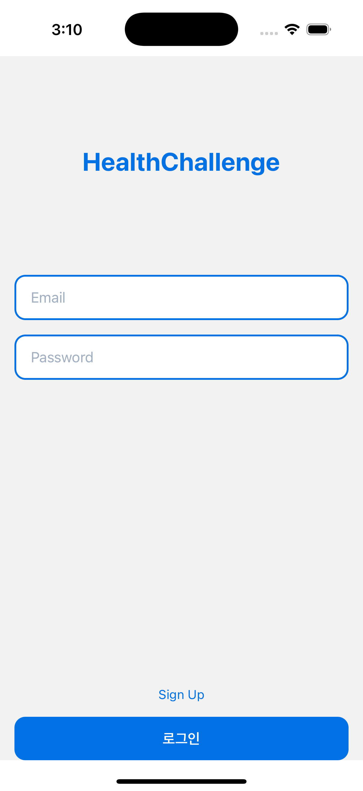
  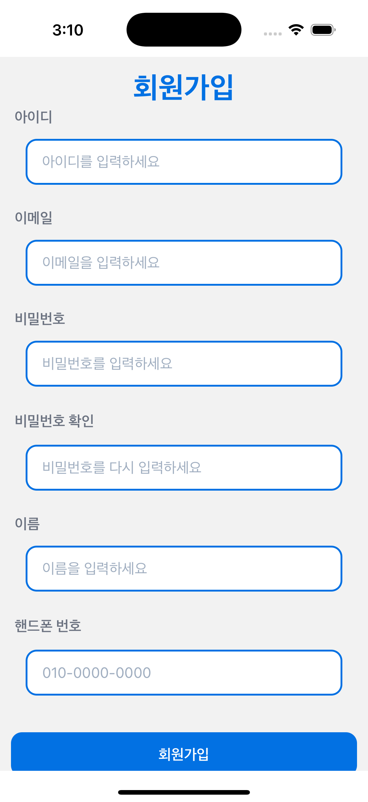
</div>
&nbsp;

- **로그인**: 이메일과 비밀번호로 로그인
- **회원가입**: 사용자 정보 입력 후 계정 생성
- **테스트 계정**:
  - 이메일: `test1234@naver.com`
  - 비밀번호: `12345678`

### 2. **건강 설문조사**
<div style="display: flex; gap: 10px;">
  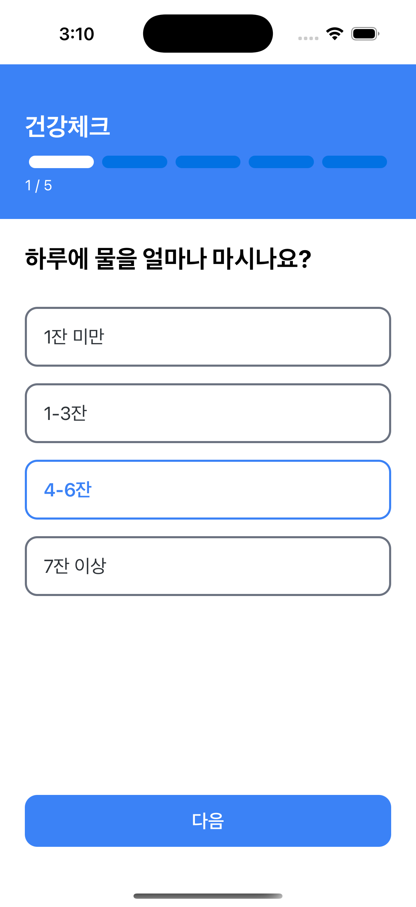
  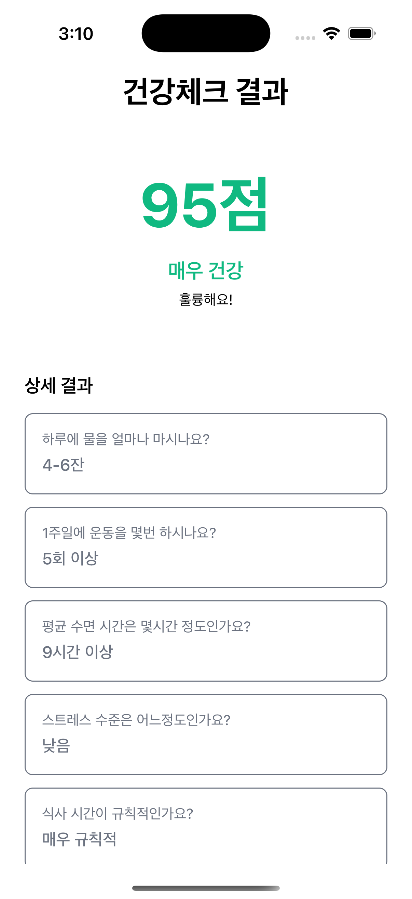
   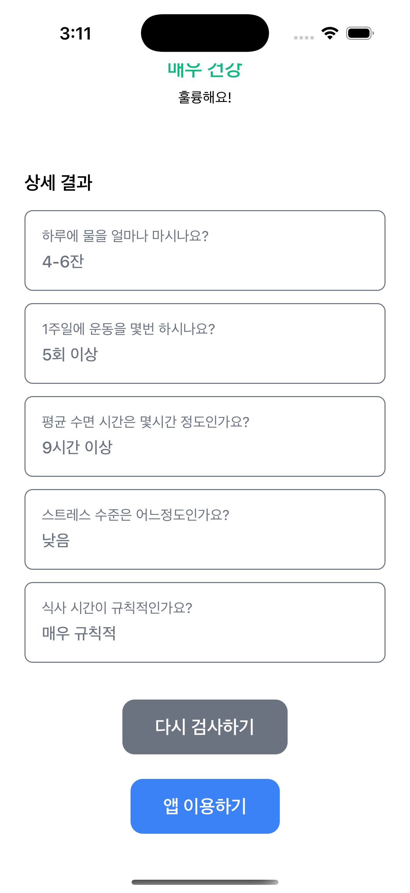
</div>
&nbsp;

- 로그인 후 필수로 진행하는 건강 상태 체크
- 5가지 항목 조사:
  - 하루 물 섭취량
  - 주간 운동 빈도
  - 평균 수면 시간
  - 스트레스 수준
  - 식사 규칙성

### 3. **상품 관리**
<div style="display: flex; gap: 10px;">
  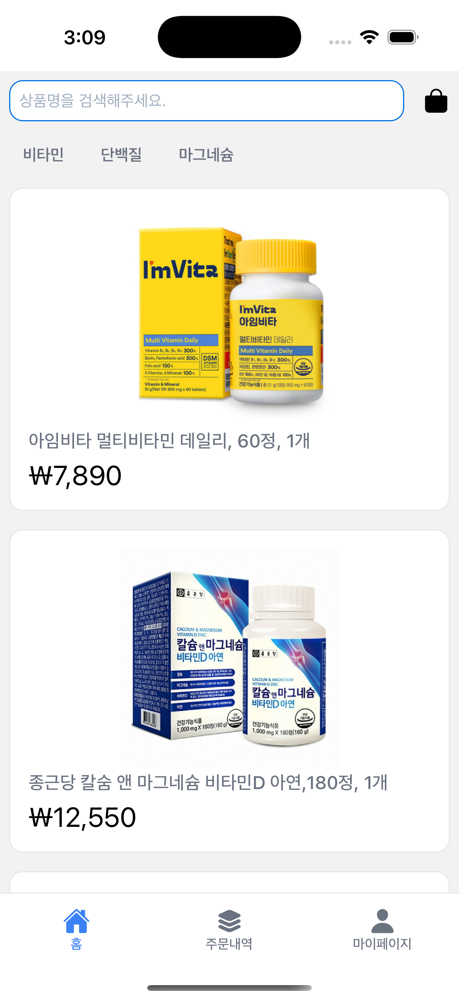
  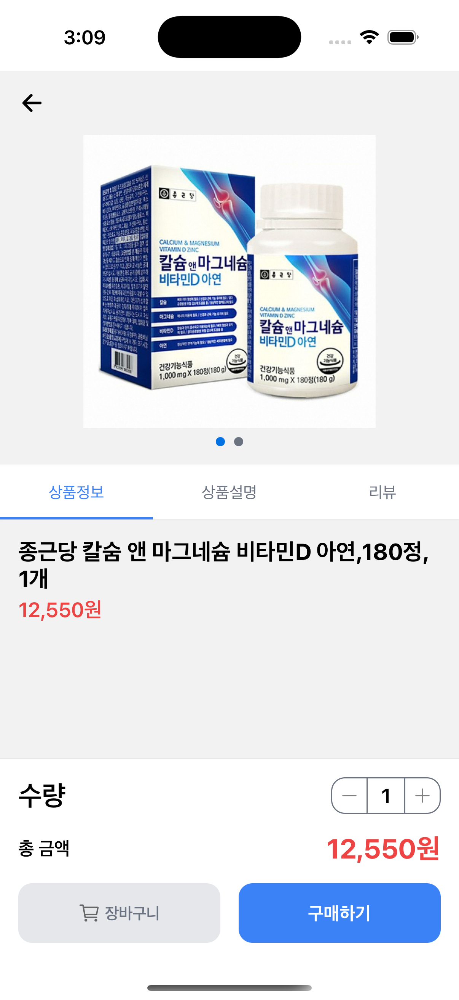
   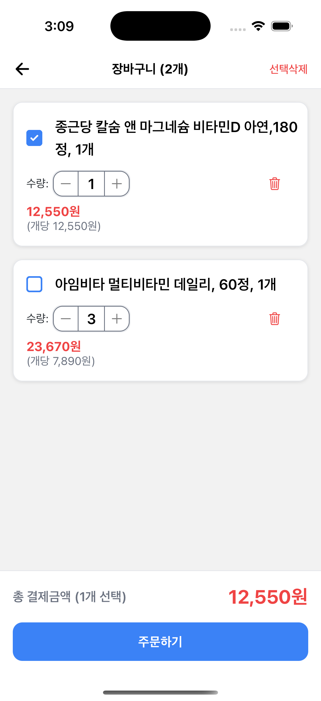
</div>
&nbsp;

- **홈 화면**: 전체 상품 목록 조회
- **상품 검색**: 상품명으로 검색 기능
- **카테고리 필터**: 비타민, 단백질, 마그네슘으로 분류
- **상품 상세**: 상품 정보, 이미지, 리뷰 확인

### 4. **쇼핑 기능**
<div style="display: flex; gap: 10px;">
  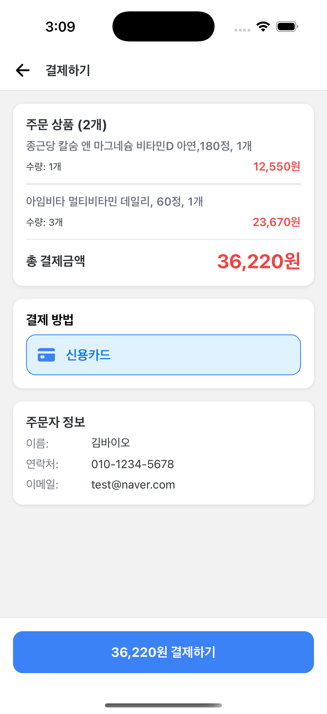
  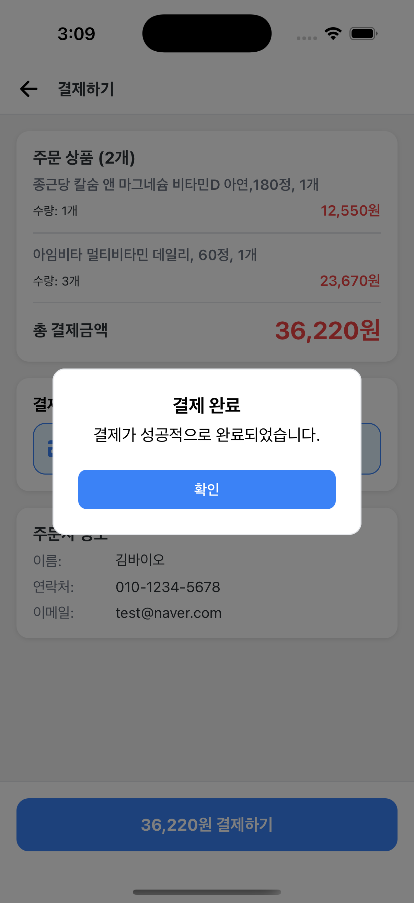
   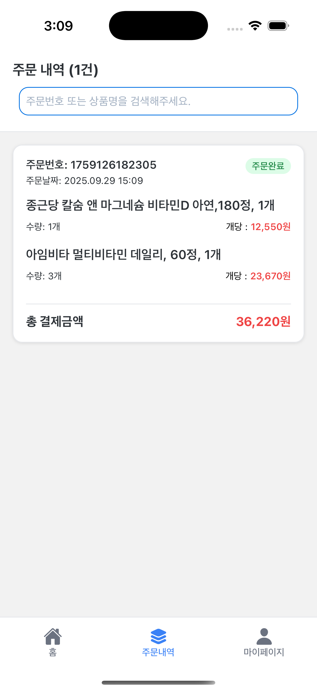
</div>

&nbsp;

- **장바구니**: 상품 추가/삭제, 수량 조정
- **주문**: 장바구니 상품 주문 처리
- **주문 내역**: 과거 주문 기록 조회

### 5. **마이 페이지**
 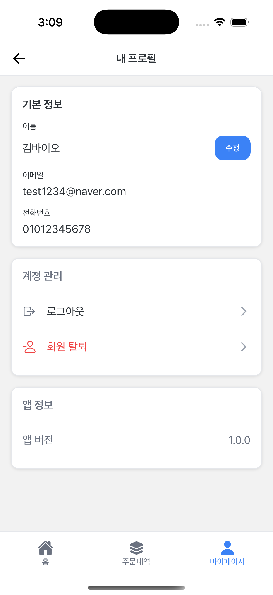

&nbsp;

- **내 정보**: 사용자 계정 정보 확인 및 이름 수정
- **계정 관리**: 로그아웃 및 회원탈퇴
- **앱 정보** : 앱버전 확인

## 🛠 기술 스택

### Frontend
- **React Native** 0.81.4
- **TypeScript**
- **React Navigation**
- **NativeWind** (Tailwind CSS for React Native)
- **Zustand** (상태 관리)

### 주요 라이브러리
- `react-native-vector-icons`: 아이콘
- `react-native-bouncy-checkbox`: 체크박스 UI
- `react-native-simple-toast`: 토스트 메시지
- `react-native-safe-area-context`: 안전 영역 관리

## 📁 프로젝트 구조

```
src/
├── components/          # 재사용 가능한 UI 컴포넌트
│   ├── TextInputBox.tsx        # 텍스트 입력 필드
│   ├── SearchInput.tsx         # 검색 입력 필드
│   ├── ProductBadge.tsx        # 상품 카테고리 배지
│   ├── PlusMinusButton.tsx     # 수량 조절 버튼
│   └── CustomDialog.tsx        # 커스텀 다이얼로그
├── screens/             # 화면 컴포넌트
│   ├── Login/
│   │   ├── LoginScreen.tsx     # 로그인 화면
│   │   └── SignUpScreen.tsx    # 회원가입 화면
│   ├── Survey/
│   │   └── SurveyScreen.tsx    # 건강 설문조사 화면
│   ├── Home/
│   │   ├── HomeScreen.tsx      # 홈 화면
│   │   └── ProductDetailScreen.tsx # 상품 상세 화면
│   ├── Basket/
│   │   └── BasketScreen.tsx    # 장바구니 화면
│   ├── Purchase/
│   │   └── PurchaseScreen.tsx  # 구매 화면
│   ├── Order/
│   │   └── OrderListScreen.tsx # 주문 내역 화면
│   └── Profile/
│       └── MyProfileScreen.tsx # 프로필 화면
├── navigation/          # 네비게이션 설정
│   ├── Navigation.tsx          # 루트 네비게이션
│   └── BottomTab.tsx          # 하단 탭 네비게이션
├── hooks/              # 커스텀 훅
│   ├── useAuthService.ts      # 인증 관련 로직
│   ├── useProductService.ts   # 상품 관련 로직
│   ├── useProductFilter.ts    # 상품 필터링
│   └── useDialog.tsx          # 다이얼로그 관리
├── store/              # 전역 상태 관리
│   ├── useCartStore.ts        # 장바구니 상태
│   └── useOrderStore.ts       # 주문 상태
├── data/               # 정적 데이터
│   ├── ProductList.ts         # 상품 목록 데이터
│   ├── ProductReview.ts       # 상품 리뷰 데이터
│   ├── questions.ts           # 설문조사 질문
│   └── healthUtils.ts         # 건강 관련 유틸리티
└── utils/              # 유틸리티 함수
    └── dateUtils.ts           # 날짜 관련 함수
```


### 설치 및 실행

1. **의존성 설치**
```bash
npm install
# 또는
yarn install
```

2. **iOS 설정** (iOS만 해당)
```bash
# CocoaPods 의존성 설치
cd ios && pod install && cd ..
```

3. **Metro 개발 서버 시작**
```bash
npm start
# 또는
yarn start
```

4. **앱 실행**

**Android:**
```bash
npm run android
# 또는
yarn android
```

**iOS:**
```bash
npm run ios
# 또는
yarn ios
```

